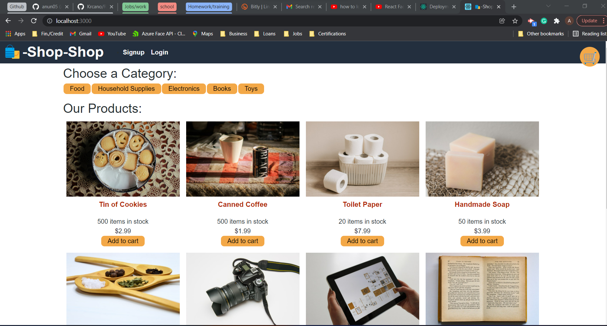
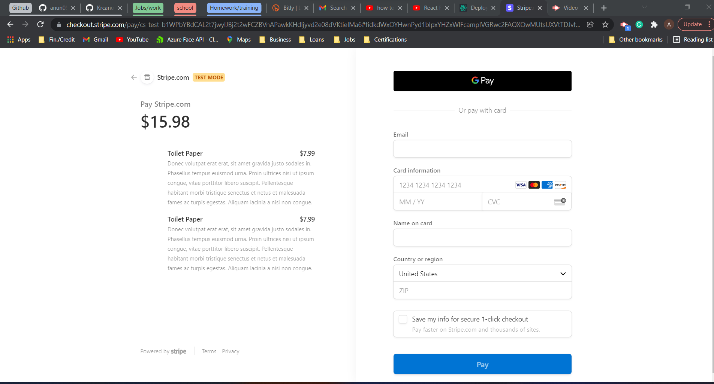

# redux-store

## Description 
The goal of this assignmentg was a refactor of code.  Web developers frequently have to immerse themselves in a new technology to solve a problem, with only that tool’s documentation for help. They must sift through it to find the information that matches the specific problem they’re trying to solve. This assignment will allow to practice a skill that you’ll use many times over the course of your career.

## How it looks

## Deployed Link
